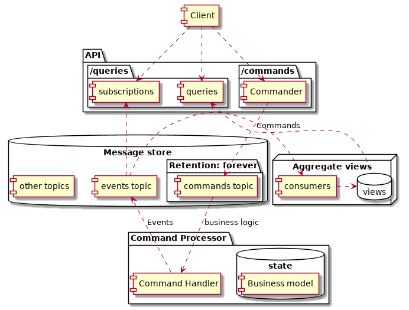

# qKafka

There are two commands availiable:

- **POST** `/values` accepts `{"value" : <f64>}` returns `HTTP/202`
  and an `id` (UUID) of the accepted value.
- **PUT** `/values/{id}` accepts
  `={"operation" : <OPERATION>, "value" : 3}` where OPERATION can be
  `ADD` or `MULTIPLY`, it returns `HTTP/202`

There is one query path constructed from the events:

- **GET** `/values/{id}` returns `{"value" : <current-value>}`

# Prerequisites

Install confluent hub client:

    curl -O http://client.hub.confluent.io/confluent-hub-client-latest.tar.gz
    # add to .bashrc:
    export PATH="<path-to>/confluent-hub-client-latest/bin:$PATH"
    # test
    confluent-hub help

# DONE Architecture

High level diagram

    [Client]

    package "API" {
      package "/queries" {
      [queries]
      [subscriptions]
      }
      package "/commands" {
        [Commander]
      }
    }

    database "Message store" {
      folder "Retention: forever" {
        [commands topic] as ct
      }
      [events topic] as et
      [other topics]
    }

    package "Command Processor" {
      [Command Handler] as CH
      database "state" {
        [Business model]
      }
    }

    node "Aggregate views" {
      [consumers]
      database "views" {
      }
    }

    Client .down.> Commander
    Client .down.> subscriptions
    Client .down.> queries
    queries <.down. views

    Commander .down.> ct : Commands
    ct ..> CH : business logic
    CH ..> et : Events

    et .> subscriptions

    et .> consumers
    consumers .> views

# Development

Start docker containers:

    docker-compose -f docker-compose.yml up

Start watcher

    cargo watch -s "cargo run"

Send some commands:

    curl -d '{"value": 2}' -H "Content-Type: application/json" -X POST http://localhost:3030/values
    # => 2753b941-eb10-497c-b58c-2b3dec1eeeef
    curl -d '{"operation": "ADD", "value": 2}' -H "Content-Type: application/json" -X PUT http://localhost:3030/values/2753b941-eb10-497c-b58c-2b3dec1eeeef
    curl -d '{"operation": "MULTIPLY", "value": 3}' -H "Content-Type: application/json" -X PUT http://localhost:3030/values/2753b941-eb10-497c-b58c-2b3dec1eeeef

Query the materialized view:

    curl -X GET -H "Content-Type: application/json" http://localhost:3030/values/2753b941-eb10-497c-b58c-2b3dec1eeeef
